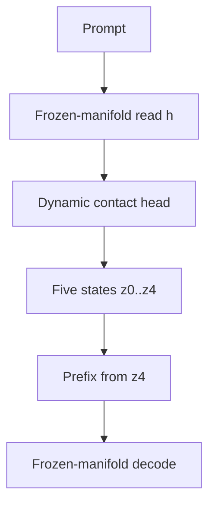

# Architecture

REAL is the coupled state of a frozen language-model manifold and an
input-conditioned contact-making head.



The current implementation performs four updates and exposes five states:
`z0`, `z1`, `z2`, `z3`, and `z4`. Generation commits from
`prefix_proj(z4)`. Describing it as four states or a `z3` commit changes the
mechanism.

## Components

### Frozen manifold

The pretrained backbone remains in evaluation mode with frozen weights. It is
the source of language, knowledge, latent trajectories, and collapse modes.
Gradients may flow through its operations to the prefix/head during fitting,
but its parameters are not updated.

### Contact-making head

The head:

1. reads a pooled prompt representation `h`
2. initializes candidate proto-intents `z0`
3. iteratively refines the selected latent state
4. predicts an energy/contact trace
5. projects the committed state into a short prefix

Conceptually:

```text
z[t+1] = z[t] + f(z[t], h, e[t], delta_e[t], step_embedding)
```

The exact implementation lives in `REALHead` inside `train_real_v1_3.py`.

### Evidence layer

Loss, pressure, context-pull, generation trace, and contact-trace probes measure
the coupled system. They are instruments, not a third component of REAL and not
runtime authority.

## Falsification structure

Every model-facing claim should compare:

1. `base`: no learned prefix
2. `static`: one global learned prefix
3. `REAL`: an input-conditioned dynamic prefix

A gain over base alone does not isolate dynamic contact. Static must be matched
because a global field can be strong.

## Public code map

| Path | Responsibility |
| --- | --- |
| `train_real_v1_3.py` | datasets, REAL head/wrapper, static baseline, fitting, evaluation |
| `real/core/` | small shared primitives and protocol metadata |
| `scripts/infer_real.py` | single-example base/static/REAL comparison |
| `scripts/reasoning_eval.py` | generation-based reasoning and uncertainty artifacts |
| `utils/` | minimal contract/probe dependency closure |
| `examples/structural_contact_demo.py` | illustrative frozen geometry; no LLM claim |
| `evidence/` | aggregate, row-free evidence only |

## Boundary around Heartbeat

Heartbeat is a separate, graduated support substrate. Its chamber-specific
topology, action, corridor, bait, mask, and authority semantics are not portable
into REAL runtime. The public seed carries only its latest aggregate negative
holdout result so the absence of promotion remains visible.
